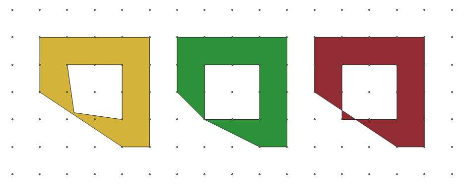
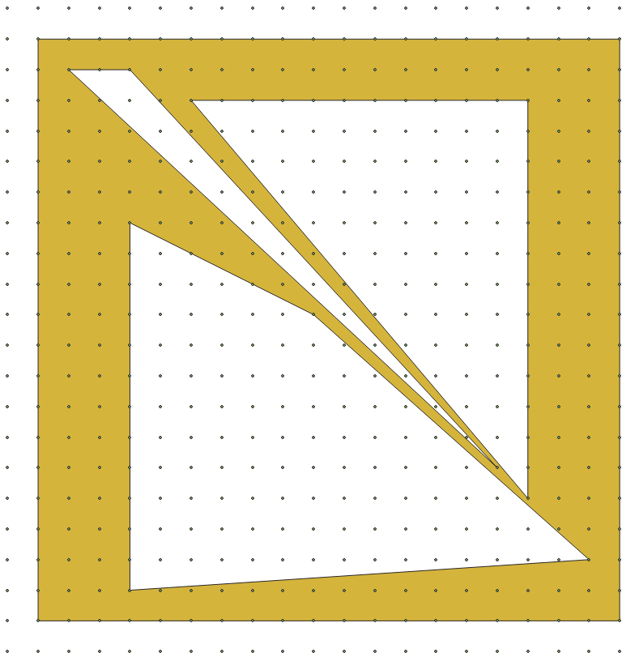

# `texel`

 [](https://github.com/PDOK/texel/releases)
[](https://goreportcard.com/report/PDOK/texel)
[](https://hub.docker.com/r/pdok/texel)

Preprocesses a [GeoPackage](https://www.geopackage.org/)
for creating _valid_ (more info below) vector tiles from it.
(And in the future probably will also create the actual vector tiles.)

The (MULTI)POLYGON geometries in a geopackage are snapped to the grid cq matrix
matching the one of the intended (internal pixel grid of the) vector tiles.
While ensuring that no (new) intersections arise from this, by adding points
to lines that skim along other vertices.
An additional benefit is that the vector tile generator needs to process fewer
data (snapping combines some points into one) and does not need any additional
processing aside from clipping and converting to the internal tile pixel grid.

## "Valid" geometries

Our definition of _valid_ is in the context of vector tiles and is more loose
than the [OGC rules](https://en.wikipedia.org/wiki/Simple_Features).
Mainly in comparison to the OGC rules, we allow:

* Overlap (not intersection)
* Linear rings or line strings with less than 3 vertices
  (effectively becoming lines or points)

With the drawing/rendering of vector tiles in mind, these invalidities do not
cause a problem. On the contrary, they introduce possibilities.
E.g. when zooming out, you would like to still see a lake as a point and a
river as a line. (The tool that this codebase is forked from, `sieve` would
filter those out.) Also when zooming out on a lake with an attached river,
you would like to keep seeing that river as a line, but still as part of the
original geometry/feature including all attributes and styling.

## Examples

Not adding extra points could create intersections:



Close thin polygons can turn into lines:

 

## Notes

- It will take a Geopackage and writes a new Geopackage with all the
  (MULTI)POLYGON tables preprocessed.
  - All other spatial tables are 'untouched' and copied as-is.
  - Other non-spatial tables are not copied to the new geopackage.
- :warning: Spatialite lib is mandatory for running this application. This lib is needed for
  creating the RTree triggers on the spatial tables for updating/maintaining the
  RTree.

## Usage

```sh
go build .

go run . -s=[source GPKG] -t=[target GPKG] -m=[tilematrix for filtering] \
   -p=[pagesize for writing to target GPKG] -o=[overwrite target GPKG]

go test ./... -covermode=atomic
```

## Docker

```docker
docker build -t pdok/texel .
docker run --rm --name texel -v `pwd`/example:/example pdok/texel ./texel \
   -s=./example/example.gpkg -t=./example/example-processed.gpkg \
   -m="{\"MinX\": -285401.92, \"MaxY\": 903401.92, \"Level\": 5, \"CellSize\": 107.52}" \
   -p=10 -o=false
```

## References

* [sieve](https://github.com/pdok/sieve) is the predecessor of this tool
  and much of its processing codebase is reused as boilerplate.
