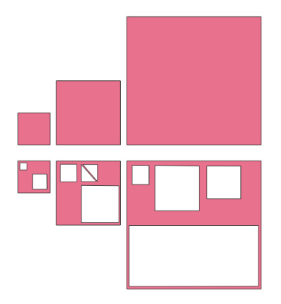
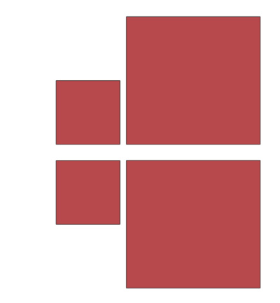

# Sieve


[](https://github.com/WouterVisscher/sieve/releases)
[](https://goreportcard.com/report/WouterVisscher/sieve)

Sieves GeoPackage Polygon geometries.

The reason for this application is to prerefine the POLYGON geometries in a geopackage used for vectortiles by filtering out geometries (based on the given resolution) smaller then the pixels that are generated from the given vectoriles. By doing this specific artifacts regarding the rendering of vectortiles can be omitted.

## Usage

```go
go build .

go run . -s=[source gpkg] -t=[target gpkg] -r=[resolution for filtering]
```

## Docker

```docker
docker build -t pdok/sieve .
docker run --rm --name sieve -v `pwd`/example:/example pdok/sieve ./sieve -s=./example/example.gpkg -t=./example/example-processed.gpkg -r=50001
```

With the docker example above processing the ```example.gpkg``` would result in the following.

  

## TODO

- [x] loop over the available POLYGON tables in a GeoPackage
- [x] copy source SpatialReferenceSystem information
- [x] use chan(feature)
- [x] move table,column and column order -> struct with methodes
- [ ] usage of a CLI package
- [ ] improve error logging/messaging
- [ ] decide on supporting MULTIPOLYGON
- [ ] decide if (MULTI)POINT|LINESTRING also are supported
- [ ] when decide not to support (MULTI)POINT|LINESTRING do we copy the source tables or do nothing at all
- [ ] build spatial indexed (RTREE for the generated tables)

## Inspiration

Code is inspired by the PostGis [Sieve function](https://github.com/mapbox/postgis-vt-util/blob/master/src/Sieve.sql) from Mapbox.
