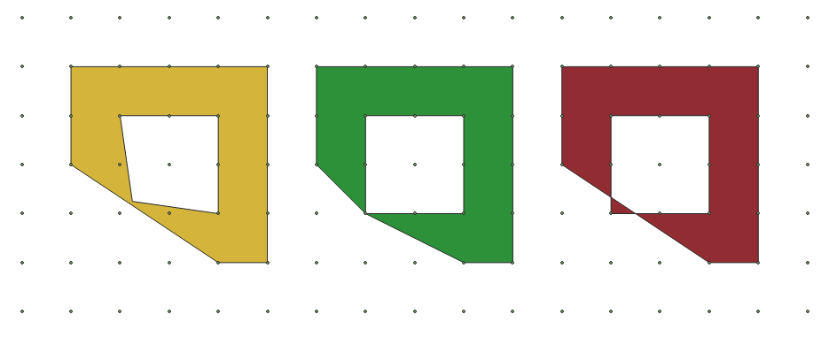
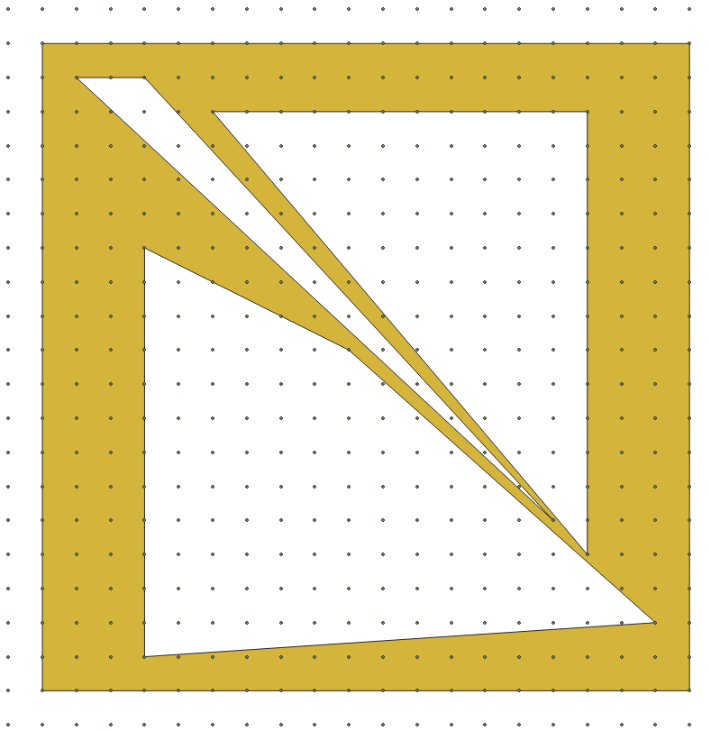

# `texel`

 [](https://github.com/PDOK/texel/releases)
[](https://goreportcard.com/report/PDOK/texel)
[](https://hub.docker.com/r/pdok/texel)

Processes a [GeoPackage](https://www.geopackage.org/) in order to produce Mapbox vector tiles.

This tool was originally created to snap MULTI(POLYGONS) to the grid cq matrix
corresponding to the vector tiles, while preserving a weak notion of _valid_
(more info below). Subsequently, the tool can be used in two ways:
- `texel snap`, which snaps the polygons.
- `texel snap -enc` with `texel mvt`. The first command snaps and encodes
  geometries according to the standard. The second assembles the tiles.

## Usage

Getting help: 

```sh
./texel --help
./texel snap --help
./texel mvt --help
```

Snap and encode geopackage

```sh
./texel snap \
   -s=[source GPKG] -t=[target GPKG] \
   -tms=[tile matrix set for filtering] -z=[tile matrix ids] \
   -p=[pagesize for writing to target GPKG] -o=[overwrite target GPKG] \
   -pl=[keep points and lines] \
   -iog=[ignore outside grid] --rwo=[reverse winding order] \
   -enc=[encode geometries] \
   -buf=[buffer size for tile detection] \
   -lt=[line trace method for tile detection] \
   -c=[current clip]
```

Make tiles from snapped output

```sh
./texel mvt \
   -c=[config toml file] \
   -z=[tile matrix id]
```

### Docker

Example Docker command for running texel without encoding geometries.

```docker
docker run \
  --name texel \
  --rm \
  -u $(id -u):$(id -g) \
  -v `pwd`/example:/example \
  pdok/texel \
    snap
    -s=./example/example.gpkg \
    -t=./example/example-processed.gpkg \
    -tms="NetherlandsRDNewQuad" \
    -z '[5]' \
    -p=10 \
    -o=false \
    -pl=true
```

## Build

```sh
go test ./... -covermode=atomic

go build .
```

### Docker

```docker
docker build -t pdok/texel .
```

:warning: Spatialite lib is mandatory for running this application. This lib is
needed for creating the RTree triggers on the spatial tables for
updating/maintaining the RTree.

## Commands

### Snapping

`texel snap` takes a geopackage, snaps all (MULTI)POLYGON geometries in it, and
writes to a new geopackage. If encoding is enabled, for each table it also
creates `{TABLENAME}_encoded` tables. A row in such a table is a geometry
encoded for a particular tile. These are required input for `texel mvt`
(explained below).

- All other spatial tables are 'untouched' and copied as-is.
- Other non-spatial tables are not copied to the new geopackage.

Input parameters:
- source (`-s`): source Geopackage.
- target (`-t`): target Geopackage. If specified as `target.gpkg`, output is
  written to `target_{zoomlevel}.gpkg` for each zoomlevel.
- tile matrix set (`-tms`): tile matrix set name. Supported tile matrix sets can
  be found in the `tms20/tilematrixsets` folder.
- tile matrix ids (`-z`): JSON array of integers of zoomlevels to target.

Snap behaviour parameters:
- keep points and lines: (`-pl`): if (part of) a polygon degenerates to points
  and lines during snapping remove those parts.
- ignore outside grid (`-iog`): skip geometries outside of the grid
- reverse winding order (`-rwo`): reverse winding order of geometries. This is
  used to comply with the vectortile standard.

Encoding behaviour parameters:
- encode (`-enc`): enable encoding. If set to false, do not create the
  `{TABLENAME}_encoded` tables.
- line trace (`-lt`): there are two algorithms to determine on which tiles a
  geometry lies. When `-lt=false`, use a bounding box. When `-lt=true`, trace
  border of features. This is more precise, but more computationally expensive.
- buffer (`-buf`): buffer size around each tile. Geometries within this buffer
  are encoded for this tile.
- clip (`-c`): a higher-level tile written as `[z, x, y]`, for zoomlevel and
  coordinates. It is required that this `z` not larger than the
  `tile-matrix-ids` above. Only encode geometries lying within this
  higher-level tile.

The `clip` parameter might require more explanation. One possible workflow is
divide a workload of generating all tiles into several "clips", for example for
parallel processing. A clip is such a tile at a higher level. In many
instances, for example when the buffer is strictly positive, the standard
workflow of `texel snap` + `texel mvt` generates tiles neighbouring the clip.
This option prevents that.

## Tile generation

The output of `texel snap -enc` is input for `texel mvt`, which generates
vectortiles. There are only a few parameters

- config (`-c`): a TOML configuration file that is detailed below.
- tile matrix id (`-z`): the zoomlevel that is being targeted.

Almost all configuration is determined in this TOML file. The configuration is
similar to configurations for
[trex](https://github.com/t-rex-tileserver/t-rex), however, valid
configurations for `trex` are not valid for `texel` in a way detailed below.
The following configuration is an example.

```toml
[tileset]
name = "NetherlandsRDNewQuad"

[[datasource]]
name = "brt"
path = "texeled/brt_12.gpkg"

[[tileset.layer]]
name = "wegdeel"
datasource = "brt"
table_name = "wegdeel_12"
minzoom = 12
maxzoom = 12

[[tileset.layer]]
name = "waterdeel"
datasource = "brt"
table_name = "waterdeel_11_12"
minzoom = 11
maxzoom = 12

[cache.file]
base = "/data"

[cache.azure]
connection_string = "{{env.AZURE_CONNECTION_STRING}}"
container = "{{env.AZURE_CONTAINER}}"
prefix_key = "{{env.AZURE_KEY_PREFIX}}"
```

Notes:
- A `[[datasource]]` is a geopackage that is results from `texel snap -enc`.
- A `[[tileset.layer]]` represents both a table in a geopackage and a layer in
  the resulting vectortile. The geopackage and table is determined by
  `datasource`, which refers to the name of a datasource and `table_name`
  (which should NOT inclde an `_encoded` suffix).

  A layer is included if the parameter `-z` specified above lies between
  `minzoom` and `maxzoom` (inclusive).
- If `[cache.file]` is specified, tiles are written with that path as base.
- If `[cache.azure]` is specified, write to the an azure blobstore.
- At least one of `[cache.file]` or `[cache.azure]` needs to be specified.
- At the destination, the tiles are written as `{NAME}/{z}/{x}/{y}.pbf`. Here
  `name` is the name of the tileset. When writing to the azure blobstore, the
  `prefix_key` is also prepended.

## "Valid" geometries

`texel snap` produces "valid" geometries.

Our definition of _valid_ is in the context of vector tiles and is more loose
than the [OGC rules](https://en.wikipedia.org/wiki/Simple_Features).
Mainly in comparison to the OGC rules, we allow:

* Overlap (not intersection)
* Linear rings or line strings with less than 3 vertices
  (effectively becoming lines or points)
* Gaps

With the drawing/rendering of vector tiles in mind, these invalidities do not
cause a problem. On the contrary, they introduce possibilities.
E.g. when zooming out, you would like to still see a lake as a point and a
river as a line. (The tool that this codebase is forked from, `sieve` would
filter those out.) Also when zooming out on a lake with an attached river,
you would like to keep seeing that river as a line, but still as part of the
original geometry/feature including all attributes and styling.

### Examples

Not adding extra points could create intersections:



Close thin polygons can turn into lines:

 

## References

* [sieve](https://github.com/pdok/sieve) is the predecessor of this tool
  and much of its processing codebase is reused as boilerplate.

